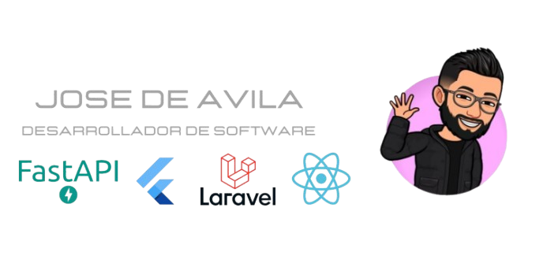

  

# Acerca de mí

¡Hola! 👋 Soy Jose De Ávila, un apasionado Desarrollador de Software. Me encanta crear soluciones tecnológicas que impulsen el crecimiento de los negocios a través de la innovación.

## Experiencia y Tecnologías

- Desarrollo móvil con Flutter y React Native 💻📱.
- Desarrollo backend con Laravel y Python (FastAPI).
- API REST con Node.js (ExpressJS), Sequelize, y conexión a bases de datos MySQL.
- Arquitectura de software basada en microservicios y arquitectura hexagonal.
- Experiencia en control de versiones usando Git y trabajo en entornos Linux.
- Conexiones WebSockets y comunicación en tiempo real.
- Uso de AWS (S3, RDS, EC2) y Google Cloud Platform (GCP).
- Implementación y uso de herramientas de inteligencia artificial (IA).
- Frontend con Vue.js (Vuex), Bootstrap, HTML5, CSS3, VanillaJS y Axios.

## Educación

📘 Actualmente, estoy culminando mis estudios en Ingeniería de Sistemas en la [Universidad Popular del Cesar](https://www.unicesar.edu.co).

Certificaciones:

- **Cloud Academic** - Google Cloud Escentials / AWS (Mayo 2023 - Junio 2023)

## Experiencia Profesional

- **Opperweb (Enero 2025 - Abril 2025)**  
  Desarrollo backend en proyecto de gestión de renta de productos, aplicando arquitectura hexagonal y Laravel 11.

- **Cámara de Comercio de Valledupar (Agosto 2024 - Agosto 2025)**  
  Consultor en ingeniería de software para el área de inspección y vigilancia.  
  Proyectos:
  - Sistema de control de asistencias automatizado.
  - Sistema de turnos multi seccional.
  - Mantenimiento de sistema interno de procesos administrativos y de empleados.

## Proyectos Destacados

1. **Mevo Taxis**

   - App de solicitud de transporte urbano virtual.
   - Flutter + Firebase.
   - [Repositorio](https://github.com/jrdeavila/Move.git)

2. **Sistematización de Servicios Internos (Club Valledupar)**

   - Plataforma web y móvil para servicios internos.
   - Web en React.js + Laravel; App móvil en Flutter.
   - [Backend](https://github.com/jrdeavila/club-valledupar-backend.git) | [App móvil](https://github.com/jrdeavila/club_valledupar_app.git)

3. **Observapp (Cámara de Comercio de Valledupar)**
   - App de indicadores socioeconómicos para comerciantes y emprendedores.
   - Arquitectura de microservicios y desarrollo en Flutter.
   - [Microservicios](https://github.com/jrdeavila/observapp-ms.git) | [App móvil](https://github.com/jrdeavila/mobile_opservapp.git) | [Administrador web](https://github.com/jrdeavila/admin_observapp.git)

## Conecta conmigo

¡Hablemos! Puedes encontrarme en:

- [LinkedIn](https://www.linkedin.com/in/jose-ricardo-de-ávila-moreno)
- [Facebook](https://www.facebook.com/jose.deavila15)

## Contacto 🔗

- 📧 morenojr15@hotmail.com | jrdeavila@unicesar.edu.co
- 📱 +57 304 224 3098
- 💻 [GitHub](https://github.com/jrdeavila)

---

¡Gracias por visitar mi perfil! 🚀 Espero que encuentres interesantes mis proyectos y contribuciones. ¡Hagamos cosas increíbles juntos!
